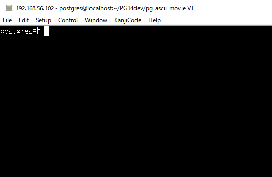

pg_ascii_movie
============

pg_ascii_movie is a PostgreSQL extension to watch ascii movies.

This was created by Tatsuro Yamada for [Advent calendar 2021](https://).

Contents
========

This README contains the following sections:

1. [Usage](#1-usage)
2. [Installation Requirements](#2-installation-requirements)
3. [Installation](#3-installation)
4. [Credits](#4-credits)


1 Usage
=======

Run the following command on psql after Installation.
	```
	postgres=# call play_sw1();
	```

Screen shot:


	
2 Installation Requirements
===========================

- file_fdw


3 Installation
==============

1. Build and Install
	```
	$ git clone
	$ cd pg_ascii_movie
	$ make -s install
	```

2. Create extensions and Set-up foreign table
	```
	$ psql
	CREATE EXTENSION file_fdw;
	CREATE EXTENSION pg_ascii_movie;
	\dx

	CREATE SERVER movies FOREIGN DATA WRAPPER file_fdw;

	CREATE FOREIGN TABLE sw1 (
	    data text
	) SERVER movies
	OPTIONS ( filename 'path/to/pg_ascii_movie/movies/sw1.txt');
	```
	Note: to use Absolute path is better for the filename

3. Test for the foreign table
	```
	select * from sw1 limit 1;
	```

4. Enjoy watching Star Wars Episode IV
	```
	call play_sw1();
	```

4 Credits
=========

* Original art work : Simon Jansen ([http://www.asciimation.co.nz/](http://www.asciimation.co.nz/))
* Inspiration: 
	* Martin W. Kirst ([ascii-telnet-server](https://github.com/nitram509/ascii-telnet-server))
	* Martin Raison ([ascii-tv](https://github.com/martinraison/ascii-tv))
	* Takeshi Tsukamoto ([emacs-starwars](https://github.com/itome/emacs-starwars))
	* skanehira ([go-starwars](https://github.com/skanehira/go-starwars))


